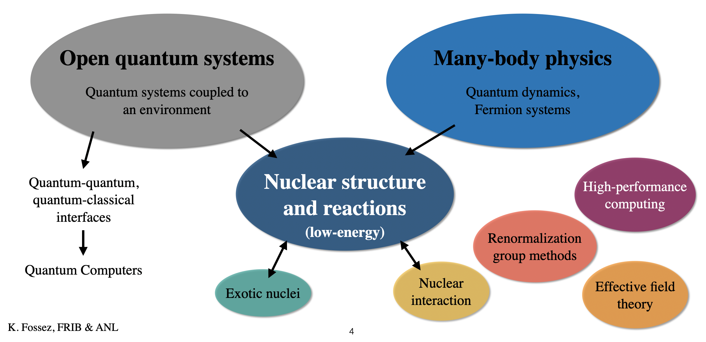

## Bio

I am an FRIB Theory Fellow at Argonne National Laboratory (ANL) and the Facility for Rare Isotope Beams (FRIB) at Michigan State University (MSU). My research interests cover the study of open quantum systems, many-body physics, low-energy nuclear structure and reactions, as well as many other related topics. I completed my PhD in 2014 at the University of Caen, France, while doing research at the Grand Accélérateur National d'Ions Lourds (GANIL) under the supervision of Prof. M. P&#322;oszajczak. 

## Interests

