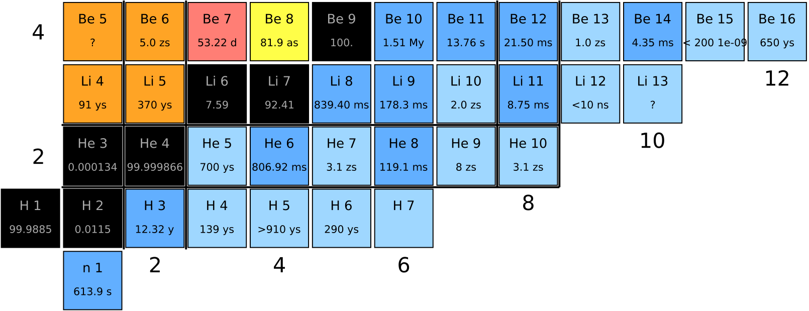
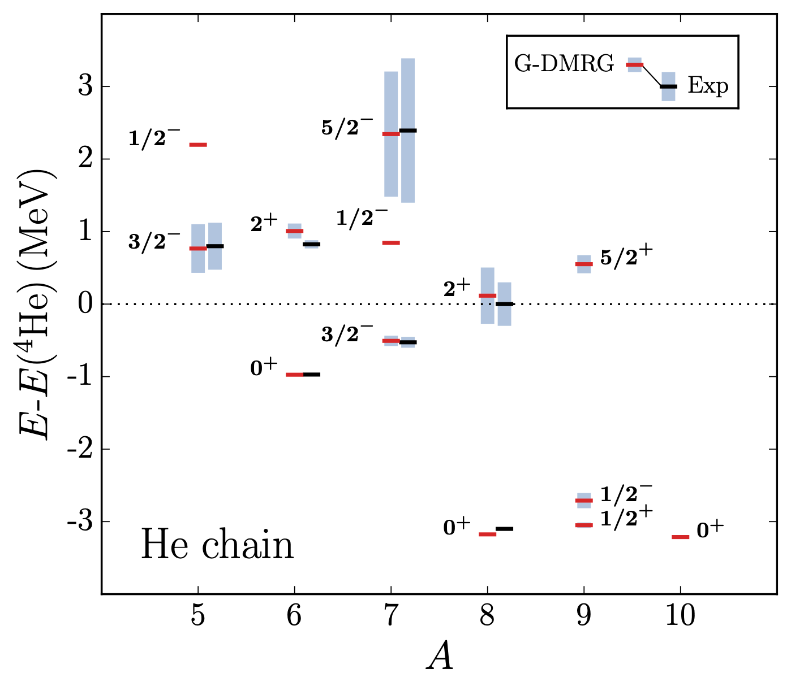
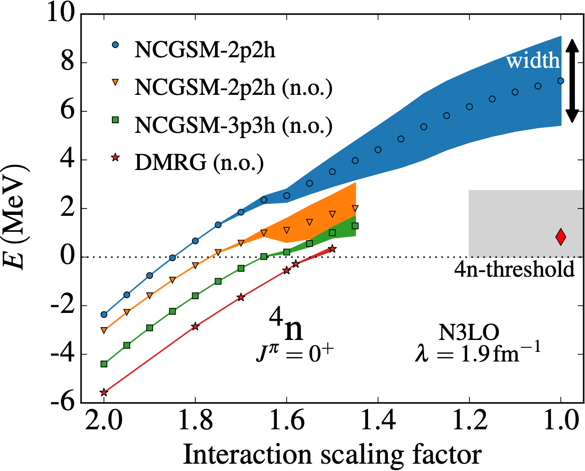



## Selected works

### Energy spectrum of neutron-rich helium isotopes: complex made simple  

**K. Fossez**, J. Rotureau, and W. Nazarewicz  
Phys. Rev. C **98**, 061302(R) (2018) [article](https://doi.org/10.1103/PhysRevC.98.061302) [arXiv](https://arxiv.org/abs/1806.02936)

We demonstrate that the intricate energy spectrum of neutron-rich helium isotopes can be straightforwardly described by taking advantage of the low-energy properties of neutron-neutron interaction and the scale separation that is present in diluted dripline systems. By using arguments based on the halo effective field theory, we carry out a parameter reduction of the complex-energy configuration interaction framework in the $spd$ space, including resonant and scattering states. By constraining the core potential to $\alpha$-n scattering phase-shifts and adjusting the strength of the spin-singlet central neutron-neutron interaction, we reproduce experimental energies and widths of $^{5-8}$He within tens of keV precision. We predict a parity inversion of narrow resonances in $^{9}$He and show that the ground state of $^{10}$He is an $s$-wave-dominated configuration that could decay through two-neutron emission. This threshold state can be viewed as a "double-halo" structure in an analogy to the atomic ${ {}^{3}\text{He}{}^{4}\text{He}_{2} }$ trimer.  

### Can tetraneutron be a narrow resonance?  

**K. Fossez**, J. Rotureau, N. Michel, and M. P&#322;oszajczak  
Phys. Rev. Lett. **119**, 032501 (2017) [article](https://doi.org/10.1103/PhysRevLett.119.032501) [arXiv](https://arxiv.org/abs/1612.01483)

The search for a resonant four-neutron system has been revived thanks to the recent experimental hints reported in Phys. Rev. Lett. **116**, 052501 (2016). The existence of such a system would deeply impact our understanding of nuclear matter and requires a critical investigation. In this work, we study the existence of a four-neutron resonance in the quasi-stationary formalism using \textit{ab initio} techniques with various two-body chiral interactions. We employ the No-Core Gamow Shell Model and the Density Matrix Renormalization Group method, both supplemented by the use of natural orbitals and a new identification technique for broad resonances. We demonstrate that while the energy of the four-neutron system may be compatible with the experimental value, its width must be larger than the reported upper limit, supporting the interpretation of the experimental observation as a reaction process too short to form a nucleus.

[FRIB highlight](https://frib.msu.edu/news/2017/tetraneutron.html), 
[NSCL highlight](https://nscl.msu.edu/news/science/news-4%20neutrons.html), 
[Physics World](https://physicsworld.com/a/can-four-neutrons-form-a-stable-nucleus/).
