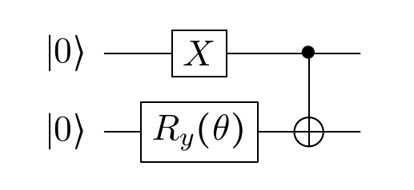

[back](./)

## Article 

- E. F. Dumitrescu, A. J. McCaskey, G. Hagen, G. R. Jansen, T. D. Morris, T. Papenbrock, R. C. Pooser, D. J. Dean, and P. Lougovski  
  _Cloud Quantum Computing of an Atomic Nucleus_  
  Phys. Rev. Lett. **120**, 210501 (2018) [article](https://doi.org/10.1103/PhysRevLett.120.210501) -- [arXiv](https://arxiv.org/abs/1801.03897)

## Details

The article is based on the Unitary Coupled Clusters (UCC) ansatz (see [link](./page_UCC.html) for details) which can be obtained using the following circuit:  

This results in the following wave function after the first operations:

$$
\newcommand{\bra}[1]{\left<#1\right|}
\newcommand{\ket}[1]{\left|#1\right>}
\begin{equation}
	\ket{ {\Psi}_{\text{UCC}} } = \cos(\frac{\theta}{2}) \ket{10} + \sin(\frac{\theta}{2}) \ket{01}
\end{equation}
$$  

The UCC ansatz wave function looks like a parametrized Bell state. 

## Hamiltonian on two qubits

Once the ansatz is set, one can apply the Hamiltonian derived in the article:

$$
\begin{equation}
	{H}_{2} = a I + b {Z}_{0} + c {Z}_{1} + d ({X}_{0} {X}_{1} + {Y}_{0} {Y}_{1})
\end{equation}
$$  
where $${ a }$$, $${ b }$$, $${ c }$$, and $${ d }$$ are constants given by the problem (see article). The identity $${ I }$$ and the $${ Z }$$ gates are trivial while the two-qubit gates $${ XX }$$ and $${ YY }$$ need to be computed before. The effect of each term of the Hamiltonian on the wave function is:  

$$
\newcommand{\bra}[1]{\left<#1\right|}
\newcommand{\ket}[1]{\left|#1\right>}
\begin{align}
  b {Z}_{0} \ket{ {\Psi}_{\text{UCC}} } 
  &= b \left( 
  \cos(\frac{\theta}{2}) 
  \begin{pmatrix}
  1 & 0 \\
  0 & -1
  \end{pmatrix}
  \begin{pmatrix}
  0 \\
  1
  \end{pmatrix}
  \otimes
  \begin{pmatrix}
  1 \\
  0
  \end{pmatrix}
	+ \sin(\frac{\theta}{2}) 
  \begin{pmatrix}
  1 & 0 \\
  0 & -1
  \end{pmatrix}
  \begin{pmatrix}
  1 \\
  0
  \end{pmatrix}
  \otimes
  \begin{pmatrix}
  0 \\
  1
  \end{pmatrix}
  \right) \\
  &= -b \cos(\frac{\theta}{2}) \ket{10} + b \sin(\frac{\theta}{2}) \ket{01}
\end{align}
$$

$$
\newcommand{\bra}[1]{\left<#1\right|}
\newcommand{\ket}[1]{\left|#1\right>}
\begin{align}
  c {Z}_{1} \ket{ {\Psi}_{\text{UCC}} } 
  &= c \left( 
  \cos(\frac{\theta}{2}) 
  \begin{pmatrix}
  0 \\
  1
  \end{pmatrix}
  \otimes
  \begin{pmatrix}
  1 & 0 \\
  0 & -1
  \end{pmatrix}
  \begin{pmatrix}
  1 \\
  0
  \end{pmatrix}
	+ \sin(\frac{\theta}{2}) 
  \begin{pmatrix}
  1 \\
  0
  \end{pmatrix}
  \otimes
  \begin{pmatrix}
  1 & 0 \\
  0 & -1
  \end{pmatrix}
  \begin{pmatrix}
  0 \\
  1
  \end{pmatrix}
  \right) \\
  &= c \cos(\frac{\theta}{2}) \ket{10} -c \sin(\frac{\theta}{2}) \ket{01}
\end{align}
$$

$$
\newcommand{\bra}[1]{\left<#1\right|}
\newcommand{\ket}[1]{\left|#1\right>}
\begin{align}
  d {X}_{0} {X}_{1} \ket{ {\Psi}_{\text{UCC}} } 
  &= d  
  \begin{pmatrix}
		0 & 0 & 0 & 1 \\
		0 & 0 & 1 & 0 \\
    0 & 1 & 0 & 0 \\
    1 & 0 & 0 & 0 
	\end{pmatrix}
  \left(
  \cos(\frac{\theta}{2})
  \begin{pmatrix}
  0 \\
  0 \\
  1 \\
  0
  \end{pmatrix}
  \sin(\frac{\theta}{2})
  \begin{pmatrix}
    0 \\
    1 \\
    0 \\
    0
  \end{pmatrix}
  \right)
\end{align}
$$ 

$$
\begin{align}
  d {Y}_{0} {Y}_{1} \ket{ {\Psi}_{\text{UCC}} } 
  &= d 
  \begin{pmatrix}
    0 & 0 & 0 & -1 \\
    0 & 0 & 1 & 0 \\
    0 & 1 & 0 & 0 \\
    -1 & 0 & 0 & 0 
  \end{pmatrix}
  \left(
  \cos(\frac{\theta}{2})
  \begin{pmatrix}
  0 \\
  0 \\
  1 \\
  0
  \end{pmatrix}
  \sin(\frac{\theta}{2})
  \begin{pmatrix}
  0 \\
  1 \\
  0 \\
  0
  \end{pmatrix}
  \right)
\end{align}
$$  

$$
\newcommand{\bra}[1]{\left<#1\right|}
\newcommand{\ket}[1]{\left|#1\right>}
\begin{align}
  d ({X}_{0} {X}_{1} + {Y}_{0} {Y}_{1}) \ket{ {\Psi}_{\text{UCC}} } 
  &= d \cos(\frac{\theta}{2}) 
  \begin{pmatrix}
    0 \\
    1 \\
    0 \\
    0
  \end{pmatrix}
  + d \sin(\frac{\theta}{2}) 
  \begin{pmatrix}
    0 \\
    0 \\
    1 \\
    0
  \end{pmatrix}
  + d \cos(\frac{\theta}{2}) 
  \begin{pmatrix}
    0 \\
    1 \\
    0 \\
    0
  \end{pmatrix}
  + d \sin(\frac{\theta}{2}) 
  \begin{pmatrix}
    0 \\
    0 \\
    1 \\
    0
  \end{pmatrix}
\end{align}
$$  

Adding the contribution from the identity one obtains:

$$
\newcommand{\bra}[1]{\left<#1\right|}
\newcommand{\ket}[1]{\left|#1\right>}
\begin{equation}
  {H}_{2} \ket{ {\Psi}_{\text{UCC}} } = \left[ (a+b-c) \sin(\frac{\theta}{2}) + 2d \cos(\frac{\theta}{2}) \right] \ket{01} + \left[ (a-b+c) \cos(\frac{\theta}{2}) + 2d \sin(\frac{\theta}{2}) \right] \ket{10}
\end{equation}
$$

One can then compute the average energy of the system as:  

$$
\newcommand{\bra}[1]{\left<#1\right|}
\newcommand{\ket}[1]{\left|#1\right>}
\newcommand{\bk}[3]{\left<#1|#2|#3\right>}
\begin{align}
  \bk{ {\Psi}_{\text{UCC}} }{ {H}_{2} }{ {\Psi}_{\text{UCC}} } 
  &= \left( \cos(\frac{\theta}{2}) \bra{10} + \sin(\frac{\theta}{2}) \bra{01} \right) 
  \left( \left[ (a+b-c) \sin(\frac{\theta}{2}) + 2d \cos(\frac{\theta}{2}) \right] \ket{01} + \left[ (a-b+c) \cos(\frac{\theta}{2}) + 2d \sin(\frac{\theta}{2}) \right] \ket{10} \right) \\
  &= \cos(\frac{\theta}{2}) \left( (a-b+c) \cos(\frac{\theta}{2}) + 2d \sin(\frac{\theta}{2}) \right) + \sin(\frac{\theta}{2}) \left( (a+b-c) \sin(\frac{\theta}{2}) + 2d \cos(\frac{\theta}{2}) \right) \\
  &= a + (c-b) \left( { \cos(\frac{\theta}{2}) }^{2} - { \sin(\frac{\theta}{2}) }^{2} \right) + 4d \sin(\frac{\theta}{2}) \cos(\frac{\theta}{2}) \\
  &= a + (c-b) \cos(\theta) + 4d \sin(\frac{\theta}{2}) \cos(\frac{\theta}{2})
\end{align}
$$

[back](./)
